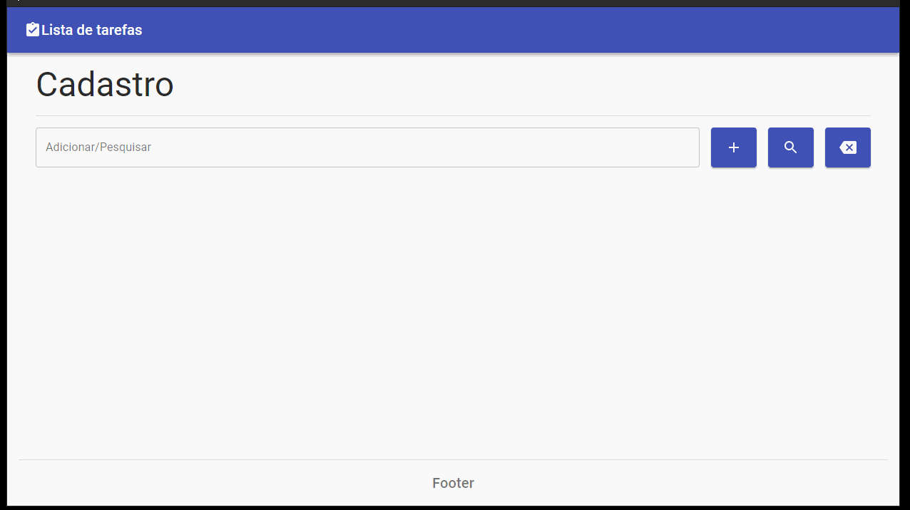

<h1 align="center"> 🚀 Demonstração </h1>


## 🔖 Sobre

Este projeto de lista de tarefas foi criado para colocar em prática conceitos de CRUD
utilizando o framework React, criação de API com NodeJS e Express e design de interface com a biblioteca Material-UI.

Foi utilizado a ferramenta **[eslint](https://eslint.org/)** no frontend para padronizar a escrita dos códigos.

---

## 🗂 Como executar o projeto

Este projeto foi dividido em duas partes, frontend e backend.

### Pré requisitos

Antes de começar, você vai precisar ter instalado em sua máquina as seguintes ferramentas:
[Git](https://git-scm.com), [Node.js](https://nodejs.org/en/) e o [MongoDB](https://www.mongodb.com/).
Além disto é bom ter um editor para trabalhar com o código como [VSCode](https://code.visualstudio.com/)

#### 🎲 Executando a aplicação

```bash
    # Clone o repositório
    $ git clone https://github.com/renatogual/todolist-react.git

    # Entre no diretório raiz
    $ cd todolist-react

    # Entre no diretório do servidor
    $ cd backend

    # Instale as dependências
    $ npm install

    # Inicie o servidor 💡Lembre-se de estar com o serviço do mongoDB online
    $ npm run dev

    # Voltar para o diretório raiz do projeto
    cd ..

    # Entrar no diretório para executar o website
    cd frontend

    # Instalar as dependências
    npm install

    # Iniciar a aplicação web
    npm run dev
```

---

## 🛠 Ferramentas utilizadas

No Frontend
- **[ReactJS](https://reactjs.org)**
- **[Axios](https://github.com/axios/axios)**
- **[Material-UI](https://material-ui.com/pt/)**


No Backend
- **[NodeJS](https://nodejs.org)**
- **[Express](https://expressjs.com/)**
- **[Node-restful](https://www.npmjs.com/package/node-restful)**
- **[Body-parser](https://www.npmjs.com/package/body-parser)**
- **[MongoDB](https://www.mongodb.com/)**
- **[Mongoose](https://mongoosejs.com/)**
